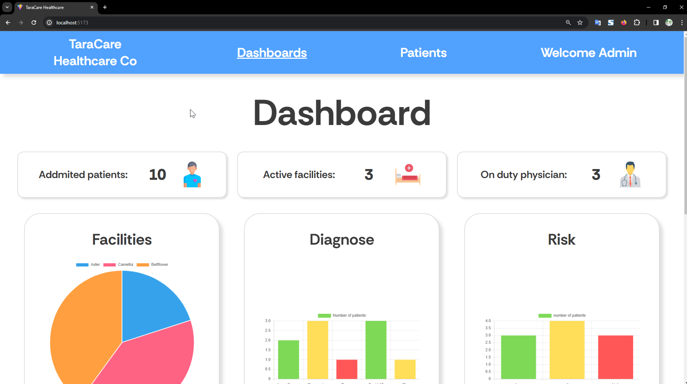

# hospital-cms
## How to run this app

- prerequisite 
```
node js
```

- running server
```
> cd server
> npm i
> npm run start
```

- running client
```
> cd server
> npm i
> npm run dev
```

## Features

### Dashboard


>A full feature dashboard showing charts and data

### List


> Showing the entire data from server. User can filter patients using name, illness, facility, and assigned physician

### Create


> User can add new patients to database and fill up patient's informations 

### Detail


> User can see patient's details and information 

### Detail


> User can see edit patient's information or delete them from the database